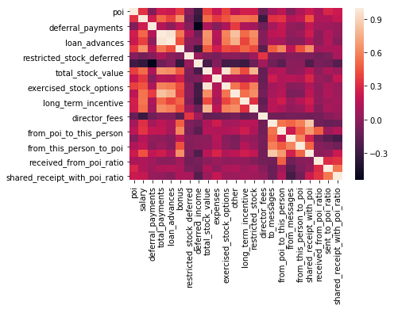

## Project Summary

#### Project Background
In 2000, Enron was one of the largest companies in the United States.
By 2002, it had collapsed into bankruptcy due to widespread corporate fraud.
In the resulting Federal investigation, a significant amount of typically
confidential information entered into the public record, including tens of
thousands of emails and detailed financial data for top executives.

In this project, I will apply machine learning techniques to build a person of
interest identifier based on financial and email data made public as a result of
the Enron scandal, which could help us to identify any potential person in the
fraud case based on the available data we collected.

In order to wrap up this detective work, we do have a list of person that are
already tagged with 'fraud' as they were addicted, reached a settlement or
deal with the government, or testified in exchange for prosecution immunity.

#### Problem Simplification
The project here is to identify persons who are in the corporate fraud based on the available data
within financial features, email features, and available 'poi' labels.

For the whole process, it could be broken down into parts below,
Feature preprocessing:
     - Outliers detection and removal
     - Fill in the nan value by considering features in different groups
     - Standardize the feature
Feature Creation
Modeling Creation/Validation:
    - Built up the pipelines and include the naive bayes, decision tree, logistic
    Regression, support vector machine, KNN, random forest, Adaboost, and Gradientboost.
    - Used grid search to find the optimal parameters based on the test result.
    - Adopted the stratified shuffle split cross validation to fully make use
     of our dataset, and pick the best model we built.

#### Dataset Overview

- Total Number: For the dataset we had, there are 146 records and 21 variables.

- Variables: The 21 variables including financial features, email features,poi labels, which I listed below,

     financial features(14)
     
     ['salary', 'deferral_payments', 'total_payments', 'loan_advances', 'bonus', 'restricted_stock_deferred', 'deferred_income', 'total_stock_value', 'expenses', 'exercised_stock_options', 'other', 'long_term_incentive', 'restricted_stock', 'director_fees'] (all units are in US dollars)

     Email features(6)
    
    ['to_messages', 'email_address', 'from_poi_to_this_person', 'from_messages', 'from_this_person_to_poi', 'shared_receipt_with_poi'] (units are generally number of emails messages; notable exception is ‘email_address’, which is a text string)

     POI Feature-POI label(1)
    
    [‘poi’] (boolean, represented as integer)

- Number of the people who are labeled as poi: Only 18 people were labeled as poi out of 146 people.

#### Outliers Issue

Based on data exploration, there are several outliers I found and will remove,
- TOTAL: This row is the sum of each variable, which need to removed.
- LOCKHART EUGENE E: Except the POI label(false), there is no data in all other
variables.
- THE TRAVEL AGENCY IN THE PARK: Not related to the person based on the name.

#### Missing Value Issue

In general, out of 146 person, most of people has no data in the loan_advances, director_fees,
restricted_stock_deferred variables, which we could see below based on the percentage,

    poi                          0.000000
    salary                       0.349315
    deferral_payments            0.732877
    total_payments               0.143836
    loan_advances                0.972603
    bonus                        0.438356
    restricted_stock_deferred    0.876712
    deferred_income              0.664384
    total_stock_value            0.136986
    expenses                     0.349315
    exercised_stock_options      0.301370
    other                        0.363014
    long_term_incentive          0.547945
    restricted_stock             0.246575
    director_fees                0.883562
    to_messages                  0.410959
    email_address                0.000000
    from_poi_to_this_person      0.410959
    from_messages                0.410959
    from_this_person_to_poi      0.410959
    shared_receipt_with_poi      0.410959
 
 For the individuals, we could check how many variables each person miss in the dataset, and 
 LOCKHART EUGENE E only has the poi label without any other avaliable variables, which need to
 be removed.
 
    LOCKHART EUGENE E                19
    GRAMM WENDY L                    17
    WROBEL BRUCE                     17
    WODRASKA JOHN                    17
    THE TRAVEL AGENCY IN THE PARK    17

For these missing values, I filled it based on the features as we could see the email features are
not missing randomly. So for the email features, I filled out based on the median of the email features,
and fill out 0 for the related financial features. 

The reason for this preprocessing is that we don't want to be misleaded by some intentional data missing
on the email features. On the other hand, we don't want to each person's data was impacted by others 
especially for the financial features, as the small number would be impacted by some huge number.

Missing count on email features
    
    to_messages                60
    email_address               0
    from_poi_to_this_person    60
    from_messages              60
    from_this_person_to_poi    60
    shared_receipt_with_poi    60
    
  
  Missing count on financial features  
  
    salary                        51
    deferral_payments            107
    total_payments                21
    loan_advances                142
    bonus                         64
    restricted_stock_deferred    128
    deferred_income               97
    total_stock_value             20
    expenses                      51
    exercised_stock_options       44
    other                         53
    long_term_incentive           80
    restricted_stock              36
    director_fees                129

#### Feature selection process

- New Feature engineered
Before feature selection, I added three features related to ratio to make the data
more reasonable, which are listed below,

a. received_from_poi_ratio: 
Received from poi/all message the person received(to_messages: the person was included in the to part)

b. sent_to_poi_ratio: Sent to poi /all message the person sent(from_messages: the person was included in the from part)

c. shared_receipt_with_poi_ratio: 'shared_receipt_with_poi'/'to_messages'
[only one record is over 1, which might be a typero, here I just assumed it is 1]

Based on the correlation calculation, we could see the three new-engineered features do get the higher correlation 
(positive) with poi compare to their previous single feature, which is a good sign to include them in the model. 

From the feature selection below (either KBest or Treebased model), sent_to_poi_ratio and shared_receipt_with_poi_ratio 
have the higher rank which need to be included in the model.

For the model validation, I checked the best performance model with original dataset without the new engineered features.
Refered by the results, the dataset without new engineered features negatively impact the model performance, which means the
new engineered features do improve the model performance either on precisons or recalls.

- KBest/PCA/TreeBased Model (Feature selection)

As the number scale in different features are different, I used the StandardScaler to
standardize all the values, although tree-based model do not require that. Then
I used three methods one are KBest/PCA/TreeBased Model to select the features. In order to get 
most potentially good features in the model, I implemented it in the pipeline with gridsearch in
order to make the features selections work on the model training.

For each of models, I tried the k from 6 to 20 features for KBest, n_components from 10 to 20, and
maximum depth from 2 to 7 with different estimator.

From the final results, 

#### Modeling Process

The project is ending up using AdaBoostClassifier model with precision 0.44974	and recall 0.34450, 
which is pretty balanced in the performance and has the
highest recall in all my models. But if we would prefer higher score in
precision(Out of all the items labeled as positive, how many truly belong to
the positive class), logisticRegression has a better performance with 0.6 precision.

Also, I tried DecisionTreeClassifier, Naive Bayes,
LogisticRegression, Support Vector Machine,K Nearest Neighbors,
RandomForestClassifier, and GradientBoostingClassifier.
The model performance do vary a lot between different models especially
in precision, recall, and f1 score, but in general accuracy and recall is
pretty hard get the higher score than the accuracy.

#### Parameter Tuning

For the model tuning, if we don't do it, it will impact the model performance. In
the project, I used grid search to tune the model and try to get the best parameter.
For the models I used, below are listed the parameters I tuned,
LogisticRegression- Penalty; C
Support Vector Machine- C; Degree; Kernel
KNN- n_neighbors
Random Forest- n_estimators; max_depth
AdaBoost- n_estimators; algorithm
GradientBoosting - loss; n_estimators; max_depth

#### Model Validation

It's the necessary way after model set up with the training dataset. It's the
process to evaluate the model using test dataset which is not used as training
dataset in the model training.The validation would be a good way to evaluate
the prediction capability of the model, and it is the necessary step to pick up
the best model.

for the validation, I changed to use StratifiedShuffleSplit to evaluate the model
performance as the dataset is pretty imbalanced.(k-fold cross validation might
be better to be used in the balanced dataset. The common
mistake would be only using accuracy to validate the model as the dataset is not balanced.

#### Matrix - Precision & Recall

Precision: How many are classified 'fraud' correctly out of all truely 'fraud' people.
if it is good, it will identify most of people involved in the fraud issue, but might
bring some innocent people in.

Recall: How many are classified 'fraud' correctly out of all labeled 'fraud' people.
if it is good, it will make sure all the labeled fraud people are higher likely involved
in the fraud, but it might miss some people involved in the fraud issue.

Precision Score is when the algorithm guesses that somebody is a POI, this measures how certain we are that the person really is a POI.
Recall Score is when the algorithm that somebody is a POI, this measures how much percentage are truely fraud in our labeled fraud group.

#### Final output

Based on the final result, I decide to choose the AdaBoostClassifier with  
precision 0.44974	and recall 0.34450	, and the parameters I chose  are
algorithm - 'SAMME.R', n_estimators 15.
