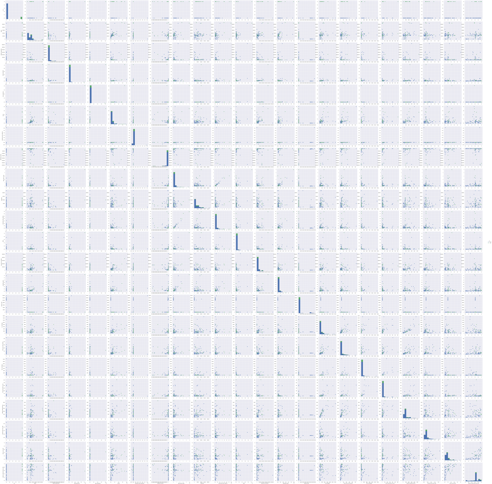

## Project: Identify Fraud from Enron Email

### Project Overview

In 2000, Enron was one of the largest companies in the United States. By 2002, it had collapsed into bankruptcy due to widespread corporate fraud. In the resulting Federal investigation, a significant amount of typically confidential information entered into the public record, including tens of thousands of emails and detailed financial data for top executives. In this project, I will apply machine learning techniques to build a person of interest identifier based on financial and email data made public as a result of the Enron scandal, which could help us  to identify any potential person in the fraud case based on the available data we collected.

In order to wrap up this detective work, we do have a list of person that are already tagged with 'fraud' as they were addicted, reached a settlement or peal deal with the government, or testified in exchange for prosecution immunity.

### Problem Clarification

Identify persons who are in the corporate fraud based on the available data within financial features, email features, and available 'poi' labels.

### Method and Process

<ul>
<li>[Part 1 Data Overview](### Dataset Overview)
<li>[Part 2 Feature Preprocessing](#Part-2-Feature-Preprocessing)
<li>[Part 3 New Feature Creation](#Part-3-New-Feature-Creation)
<li>[Part 4 Feature Selection](#Part-4:-Feature-Selection)
<li>[Part 5 Modelling Training](#Part-5:-Modelling-Training)
<li>[Part 6 Result](#Part-6:-Result)
</ul>


```python
%matplotlib inline
import matplotlib.pyplot as plt
```


```python

import sys
sys.path.append("../tools/")
import pandas as pd
import numpy as np
pd.set_option('display.max_columns', None)
import seaborn as sb
import pickle

import warnings
warnings.filterwarnings('ignore')
```

### Part1: Dataset Overview

#### Dataset overivew


```python
with open("final_project_dataset.pkl", "r") as data_file:
    data_dict = pickle.load(data_file)
```


```python
data=pd.DataFrame.from_dict(data_dict,orient='index')  # read the data and traverse the columns and rows
```


```python
finance_features = ['salary', 'deferral_payments', 'total_payments', 'loan_advances', 'bonus',
                 'restricted_stock_deferred', 'deferred_income', 'total_stock_value', 'expenses',
                 'exercised_stock_options', 'other', 'long_term_incentive', 'restricted_stock',
                 'director_fees']
email_features = ['to_messages', 'email_address', 'from_poi_to_this_person', 'from_messages', 'from_this_person_to_poi',
              'shared_receipt_with_poi']

poi_feature=['poi']

feature_list=poi_feature + finance_features + email_features
```


```python
#reorder the features
data=data.ix[:,feature_list]
```


```python
data.head()
```


#### Data Type


```python
data_type=[bool]+[np.float]*15+[str]+[np.float]*4
```


```python
for i in range(len(feature_list)):
    data[feature_list[i]]=data[feature_list[i]].astype(data_type[i])
```


```python
print "Num of rows: " + str(data.shape[0]) # row count
print "Num of columns: " + str(data.shape[1]) # col count
```

    Num of rows: 146
    Num of columns: 21


For the dataset we had, there are 146 records and 21 variables.

The 21 variables including financial features, email features,poi labels, which I listed below,

- financial features(14)

['salary', 'deferral_payments', 'total_payments', 'loan_advances', 'bonus', 'restricted_stock_deferred', 'deferred_income', 'total_stock_value', 'expenses', 'exercised_stock_options', 'other', 'long_term_incentive', 'restricted_stock', 'director_fees'] (all units are in US dollars)

- Email features(6)

['to_messages', 'email_address', 'from_poi_to_this_person', 'from_messages', 'from_this_person_to_poi', 'shared_receipt_with_poi']
(units are generally number of emails messages; notable exception is ‘email_address’, which is a text string)

- POI label(1)

[‘poi’] (boolean, represented as integer)


- Number of the people who are labeled as poi


```python
data.loc[data.poi==True,'poi'].count()
```


    18


### Part 2:  Feature Preprocessing

#### Null value check in the dataset

Considering there are only 146 people in the dataset, most of people has no data in the loan_advances,director_fees,restricted_stock_deferred variables.


```python
data.isnull().sum()/data.shape[0]
```


    poi                          0.000000
    salary                       0.349315
    deferral_payments            0.732877
    total_payments               0.143836
    loan_advances                0.972603
    bonus                        0.438356
    restricted_stock_deferred    0.876712
    deferred_income              0.664384
    total_stock_value            0.136986
    expenses                     0.349315
    exercised_stock_options      0.301370
    other                        0.363014
    long_term_incentive          0.547945
    restricted_stock             0.246575
    director_fees                0.883562
    to_messages                  0.410959
    email_address                0.000000
    from_poi_to_this_person      0.410959
    from_messages                0.410959
    from_this_person_to_poi      0.410959
    shared_receipt_with_poi      0.410959
    dtype: float64


```python
data.isnull().sum(axis=1).sort_values(ascending=False).head()
```


    LOCKHART EUGENE E                19
    GRAMM WENDY L                    17
    WROBEL BRUCE                     17
    WODRASKA JOHN                    17
    THE TRAVEL AGENCY IN THE PARK    17
    dtype: int64


As what we could see, only email_address have no nan value, and the info that person missed most is LOCKHART EUGENE E who only had poi labels and email address, which we could remove later.

For the nan value filling,


```python
data.loc[:,finance_features].isnull().sum()
```


    salary                        51
    deferral_payments            107
    total_payments                21
    loan_advances                142
    bonus                         64
    restricted_stock_deferred    128
    deferred_income               97
    total_stock_value             20
    expenses                      51
    exercised_stock_options       44
    other                         53
    long_term_incentive           80
    restricted_stock              36
    director_fees                129
    dtype: int64


```python
data.loc[:,email_features].isnull().sum()
```


    to_messages                60
    email_address               0
    from_poi_to_this_person    60
    from_messages              60
    from_this_person_to_poi    60
    shared_receipt_with_poi    60
    dtype: int64


we could see the number of missing value in the email features are the same, which means there are certain people consistently missing in the email features. Of them, there are some people are labeled as poi, and their email features might be lost by means. So, I will fill out those null value related to email features with median value.


```python
data[email_features] = data[email_features].fillna(data[email_features].median())
```

For the financial features, the info are missing in different variables for different people, and the value could be 0 if the null value in the table. So, I will fill in 0 if it is null.


```python
data[finance_features] = data[finance_features].fillna(0)
```

#### Outliers Detection & Removal


```python
data.describe()
```


```python
fig=data.hist(figsize=(50, 40))
#fig=data2.hist(figsize=(50, 40))
draw=[x.title.set_size(32) for x in fig.ravel()]
```


- Finance Features


```python
data.iloc[:,range(1,15)].plot(kind='box', figsize=[8,4],fontsize=8,rot=45)
```


    <matplotlib.axes._subplots.AxesSubplot at 0x1a1e40ca50>


- Email Features


```python
data.iloc[:,[15]+range(17,21)].plot(kind='box', figsize=[8,4],fontsize=8,rot=45)
```


    <matplotlib.axes._subplots.AxesSubplot at 0x10bc906d0>


```python
#data2.iloc[:,range(0,14)].plot(kind='box', figsize=[8,4],fontsize=8,rot=45)
#data2.iloc[:,range(14,19)].plot(kind='box', figsize=[8,4],fontsize=8,rot=45)
```

As what we could noticed from the graph above, we could notice the dataset definitely exists outliers. Here we could see those outliers should be removed,

- TOTAL: This row is the sum of each variable, which need to removed.
- LOCKHART EUGENE E: Except the POI label(false), there is no data in all other variables.
- THE TRAVEL AGENCY IN THE PARK: Not related to the person based on the name.


```python
data.iloc[:,2].sort_values(ascending=False).head()
```


    TOTAL               32083396.0
    FREVERT MARK A       6426990.0
    HORTON STANLEY C     3131860.0
    HUMPHREY GENE E      2964506.0
    ALLEN PHILLIP K      2869717.0
    Name: deferral_payments, dtype: float64


```python
data.loc['LOCKHART EUGENE E',]
```


    poi                          False
    salary                           0
    deferral_payments                0
    total_payments                   0
    loan_advances                    0
    bonus                            0
    restricted_stock_deferred        0
    deferred_income                  0
    total_stock_value                0
    expenses                         0
    exercised_stock_options          0
    other                            0
    long_term_incentive              0
    restricted_stock                 0
    director_fees                    0
    to_messages                   1211
    email_address                  NaN
    from_poi_to_this_person         35
    from_messages                   41
    from_this_person_to_poi          8
    shared_receipt_with_poi      740.5
    Name: LOCKHART EUGENE E, dtype: object


Also, after checking all the columns, BELFER ROBERT and BHATNAGAR SANJAY might have the data misalighment in total_stock_value, restricted_stock, and deferral_payments, which only these two variables contain the negative value in that three variables.


```python
data.iloc[:,2].sort_values().head()
data.iloc[:,8].sort_values().head()
data.iloc[:,13].sort_values().head()

#data.iloc[:,8].sort_values().head()
#total_stock_value  8   BELFER ROBERT
#restricted_stock  13   BHATNAGAR SANJAY
#deferral_payments  2- BELFER ROBERT
#data.loc['BELFER ROBERT',]
#data.loc['BHATNAGAR SANJAY',]
```


    BHATNAGAR SANJAY          -2604490.0
    YEAP SOON                        0.0
    PICKERING MARK R                 0.0
    PEREIRA PAULO V. FERRAZ          0.0
    MEYER JEROME J                   0.0
    Name: restricted_stock, dtype: float64


```python
data.loc['BHATNAGAR SANJAY',]
```


    poi                                               False
    salary                                                0
    deferral_payments                                     0
    total_payments                              1.54563e+07
    loan_advances                                         0
    bonus                                                 0
    restricted_stock_deferred                   1.54563e+07
    deferred_income                                       0
    total_stock_value                                     0
    expenses                                              0
    exercised_stock_options                     2.60449e+06
    other                                            137864
    long_term_incentive                                   0
    restricted_stock                           -2.60449e+06
    director_fees                                    137864
    to_messages                                         523
    email_address                sanjay.bhatnagar@enron.com
    from_poi_to_this_person                               0
    from_messages                                        29
    from_this_person_to_poi                               1
    shared_receipt_with_poi                             463
    Name: BHATNAGAR SANJAY, dtype: object


```python
data=data[(data.index!='TOTAL')]
data=data[(data.index!='LOCKHART EUGENE E')]
data=data[(data.index!='THE TRAVEL AGENCY IN THE PARK')]
```


```python
data.loc['BHATNAGAR SANJAY','restricted_stock']=-data.loc['BHATNAGAR SANJAY','restricted_stock']
data.loc['BELFER ROBERT','total_stock_value']=-data.loc['BELFER ROBERT','total_stock_value']
data.loc['BELFER ROBERT','restricted_stock']=-data.loc['BELFER ROBERT','restricted_stock']
```

### Part 3:  Additional Features Creation

Intuitively, we know that the number of emails sent to or received from POI is important for us to indentify the potential POI if we know some one is labeled as POI.

For the features related to the email and poi, it would be much better to represent in percentage way. For from_messages variables, it

- received_from_poi_ratio: Received from poi/all message the person received (to_messages: the person was included in the to part)
- sent_to_poi_ratio: Sent to poi /all message the person sent (from_messages: the person was included in the from part)
- shared_receipt_with_poi_ratio: 'shared_receipt_with_poi'/'to_messages'[only one record is over 1, which might be a typero, here I just assumed it is 1]


```python
data['received_from_poi_ratio']=data['from_poi_to_this_person']/data['to_messages']
data['sent_to_poi_ratio']=data['from_this_person_to_poi']/data['from_messages']
data['shared_receipt_with_poi_ratio']=data['shared_receipt_with_poi']/data['to_messages']
```


```python
data['received_from_poi_ratio'].sort_values(ascending=False).head()
```


    DONAHUE JR JEFFREY M    0.217341
    DEFFNER JOSEPH M        0.161064
    COLWELL WESLEY          0.136519
    REDMOND BRIAN L         0.122083
    DIETRICH JANET R        0.118585
    Name: received_from_poi_ratio, dtype: float64


```python
data['sent_to_poi_ratio'].sort_values(ascending=False).head()
```


    HUMPHREY GENE E       1.000000
    SHERRICK JEFFREY B    0.720000
    HANNON KEVIN P        0.656250
    GARLAND C KEVIN       0.613636
    RIEKER PAULA H        0.585366
    Name: sent_to_poi_ratio, dtype: float64


```python
data['shared_receipt_with_poi_ratio'].sort_values(ascending=False).head()
```


    GLISAN JR BEN F    1.001145
    HANNON KEVIN P     0.990431
    SUNDE MARTIN       0.969022
    KOENIG MARK E      0.956613
    RICE KENNETH D     0.954696
    Name: shared_receipt_with_poi_ratio, dtype: float64


### Part 4: Feature selection


```python
import seaborn as sb
corr=data.corr()
corr
```


<div>
<table border="1" class="dataframe">
  <thead>
    <tr style="text-align: right;">
      <th></th>
      <th>poi</th>
      <th>salary</th>
      <th>deferral_payments</th>
      <th>total_payments</th>
      <th>loan_advances</th>
      <th>bonus</th>
      <th>restricted_stock_deferred</th>
      <th>deferred_income</th>
      <th>total_stock_value</th>
      <th>expenses</th>
      <th>exercised_stock_options</th>
      <th>other</th>
      <th>long_term_incentive</th>
      <th>restricted_stock</th>
      <th>director_fees</th>
      <th>to_messages</th>
      <th>from_poi_to_this_person</th>
      <th>from_messages</th>
      <th>from_this_person_to_poi</th>
      <th>shared_receipt_with_poi</th>
      <th>received_from_poi_ratio</th>
      <th>sent_to_poi_ratio</th>
      <th>shared_receipt_with_poi_ratio</th>
    </tr>
  </thead>
  <tbody>
    <tr>
      <th>poi</th>
      <td>1.000000</td>
      <td>0.338851</td>
      <td>-0.039880</td>
      <td>0.242020</td>
      <td>0.220183</td>
      <td>0.358486</td>
      <td>-0.021548</td>
      <td>-0.274150</td>
      <td>0.382604</td>
      <td>0.203545</td>
      <td>0.386853</td>
      <td>0.169829</td>
      <td>0.256405</td>
      <td>0.242745</td>
      <td>-0.121886</td>
      <td>0.078147</td>
      <td>0.170582</td>
      <td>-0.036664</td>
      <td>0.123589</td>
      <td>0.223100</td>
      <td>0.108427</td>
      <td>0.288676</td>
      <td>0.228179</td>
    </tr>
    <tr>
      <th>salary</th>
      <td>0.338851</td>
      <td>1.000000</td>
      <td>0.242486</td>
      <td>0.511317</td>
      <td>0.388443</td>
      <td>0.648715</td>
      <td>-0.089183</td>
      <td>-0.329262</td>
      <td>0.520906</td>
      <td>0.358144</td>
      <td>0.448741</td>
      <td>0.544787</td>
      <td>0.559334</td>
      <td>0.524957</td>
      <td>-0.305364</td>
      <td>0.324901</td>
      <td>0.345583</td>
      <td>0.138092</td>
      <td>0.189497</td>
      <td>0.443302</td>
      <td>0.124683</td>
      <td>0.129174</td>
      <td>0.206958</td>
    </tr>
    <tr>
      <th>deferral_payments</th>
      <td>-0.039880</td>
      <td>0.242486</td>
      <td>1.000000</td>
      <td>0.141078</td>
      <td>0.014509</td>
      <td>0.173795</td>
      <td>-0.030513</td>
      <td>-0.543115</td>
      <td>0.118197</td>
      <td>-0.021808</td>
      <td>0.117192</td>
      <td>0.368698</td>
      <td>0.119072</td>
      <td>0.083111</td>
      <td>-0.095386</td>
      <td>0.094472</td>
      <td>0.198518</td>
      <td>0.026744</td>
      <td>-0.005301</td>
      <td>0.186455</td>
      <td>0.072302</td>
      <td>0.069033</td>
      <td>0.044646</td>
    </tr>
    <tr>
      <th>total_payments</th>
      <td>0.242020</td>
      <td>0.511317</td>
      <td>0.141078</td>
      <td>1.000000</td>
      <td>0.964305</td>
      <td>0.559531</td>
      <td>0.127582</td>
      <td>-0.103456</td>
      <td>0.661505</td>
      <td>0.150690</td>
      <td>0.598725</td>
      <td>0.830105</td>
      <td>0.520313</td>
      <td>0.635638</td>
      <td>-0.026504</td>
      <td>0.174581</td>
      <td>0.197022</td>
      <td>0.006684</td>
      <td>0.055281</td>
      <td>0.236661</td>
      <td>-0.002791</td>
      <td>0.130594</td>
      <td>0.029655</td>
    </tr>
    <tr>
      <th>loan_advances</th>
      <td>0.220183</td>
      <td>0.388443</td>
      <td>0.014509</td>
      <td>0.964305</td>
      <td>1.000000</td>
      <td>0.432525</td>
      <td>-0.004905</td>
      <td>-0.025184</td>
      <td>0.630305</td>
      <td>0.121469</td>
      <td>0.568214</td>
      <td>0.759406</td>
      <td>0.402115</td>
      <td>0.584563</td>
      <td>-0.027745</td>
      <td>0.106226</td>
      <td>0.090993</td>
      <td>-0.020704</td>
      <td>-0.013475</td>
      <td>0.130868</td>
      <td>-0.012560</td>
      <td>0.132960</td>
      <td>-0.014186</td>
    </tr>
    <tr>
      <th>bonus</th>
      <td>0.358486</td>
      <td>0.648715</td>
      <td>0.173795</td>
      <td>0.559531</td>
      <td>0.432525</td>
      <td>1.000000</td>
      <td>-0.043467</td>
      <td>-0.330985</td>
      <td>0.460612</td>
      <td>0.243870</td>
      <td>0.415811</td>
      <td>0.383152</td>
      <td>0.497030</td>
      <td>0.416394</td>
      <td>-0.177496</td>
      <td>0.477363</td>
      <td>0.612999</td>
      <td>0.169924</td>
      <td>0.437479</td>
      <td>0.642261</td>
      <td>0.081763</td>
      <td>0.112762</td>
      <td>0.118197</td>
    </tr>
    <tr>
      <th>restricted_stock_deferred</th>
      <td>-0.021548</td>
      <td>-0.089183</td>
      <td>-0.030513</td>
      <td>0.127582</td>
      <td>-0.004905</td>
      <td>-0.043467</td>
      <td>1.000000</td>
      <td>0.047988</td>
      <td>-0.045276</td>
      <td>-0.067996</td>
      <td>-0.002355</td>
      <td>-0.007366</td>
      <td>-0.039044</td>
      <td>0.068385</td>
      <td>0.346195</td>
      <td>-0.048455</td>
      <td>-0.065988</td>
      <td>-0.023412</td>
      <td>-0.025693</td>
      <td>-0.048171</td>
      <td>-0.095137</td>
      <td>-0.066484</td>
      <td>0.100386</td>
    </tr>
    <tr>
      <th>deferred_income</th>
      <td>-0.274150</td>
      <td>-0.329262</td>
      <td>-0.543115</td>
      <td>-0.103456</td>
      <td>-0.025184</td>
      <td>-0.330985</td>
      <td>0.047988</td>
      <td>1.000000</td>
      <td>-0.244217</td>
      <td>-0.039982</td>
      <td>-0.268070</td>
      <td>-0.265277</td>
      <td>-0.295815</td>
      <td>-0.120796</td>
      <td>0.076548</td>
      <td>-0.094150</td>
      <td>-0.176887</td>
      <td>-0.012481</td>
      <td>0.002251</td>
      <td>-0.220116</td>
      <td>-0.070045</td>
      <td>-0.096518</td>
      <td>-0.199225</td>
    </tr>
    <tr>
      <th>total_stock_value</th>
      <td>0.382604</td>
      <td>0.520906</td>
      <td>0.118197</td>
      <td>0.661505</td>
      <td>0.630305</td>
      <td>0.460612</td>
      <td>-0.045276</td>
      <td>-0.244217</td>
      <td>1.000000</td>
      <td>0.151427</td>
      <td>0.963876</td>
      <td>0.634445</td>
      <td>0.420772</td>
      <td>0.777930</td>
      <td>-0.147469</td>
      <td>0.118138</td>
      <td>0.138768</td>
      <td>-0.012657</td>
      <td>0.019538</td>
      <td>0.164943</td>
      <td>0.003702</td>
      <td>0.119527</td>
      <td>0.058316</td>
    </tr>
    <tr>
      <th>expenses</th>
      <td>0.203545</td>
      <td>0.358144</td>
      <td>-0.021808</td>
      <td>0.150690</td>
      <td>0.121469</td>
      <td>0.243870</td>
      <td>-0.067996</td>
      <td>-0.039982</td>
      <td>0.151427</td>
      <td>1.000000</td>
      <td>0.120587</td>
      <td>0.137773</td>
      <td>0.095488</td>
      <td>0.166662</td>
      <td>-0.139616</td>
      <td>0.230145</td>
      <td>0.127826</td>
      <td>0.153611</td>
      <td>0.128861</td>
      <td>0.282533</td>
      <td>0.050452</td>
      <td>0.007256</td>
      <td>0.203860</td>
    </tr>
    <tr>
      <th>exercised_stock_options</th>
      <td>0.386853</td>
      <td>0.448741</td>
      <td>0.117192</td>
      <td>0.598725</td>
      <td>0.568214</td>
      <td>0.415811</td>
      <td>-0.002355</td>
      <td>-0.268070</td>
      <td>0.963876</td>
      <td>0.120587</td>
      <td>1.000000</td>
      <td>0.550551</td>
      <td>0.398533</td>
      <td>0.593649</td>
      <td>-0.117222</td>
      <td>0.082472</td>
      <td>0.125956</td>
      <td>-0.024659</td>
      <td>0.000015</td>
      <td>0.130349</td>
      <td>0.010533</td>
      <td>0.102896</td>
      <td>0.056889</td>
    </tr>
    <tr>
      <th>other</th>
      <td>0.169829</td>
      <td>0.544787</td>
      <td>0.368698</td>
      <td>0.830105</td>
      <td>0.759406</td>
      <td>0.383152</td>
      <td>-0.007366</td>
      <td>-0.265277</td>
      <td>0.634445</td>
      <td>0.137773</td>
      <td>0.550551</td>
      <td>1.000000</td>
      <td>0.534612</td>
      <td>0.637399</td>
      <td>-0.080532</td>
      <td>0.094760</td>
      <td>0.154526</td>
      <td>-0.055969</td>
      <td>-0.054048</td>
      <td>0.179374</td>
      <td>0.021278</td>
      <td>0.131829</td>
      <td>0.054669</td>
    </tr>
    <tr>
      <th>long_term_incentive</th>
      <td>0.256405</td>
      <td>0.559334</td>
      <td>0.119072</td>
      <td>0.520313</td>
      <td>0.402115</td>
      <td>0.497030</td>
      <td>-0.039044</td>
      <td>-0.295815</td>
      <td>0.420772</td>
      <td>0.095488</td>
      <td>0.398533</td>
      <td>0.534612</td>
      <td>1.000000</td>
      <td>0.335913</td>
      <td>-0.158735</td>
      <td>0.153017</td>
      <td>0.238692</td>
      <td>0.052083</td>
      <td>0.148067</td>
      <td>0.244716</td>
      <td>0.022573</td>
      <td>0.066582</td>
      <td>0.080914</td>
    </tr>
    <tr>
      <th>restricted_stock</th>
      <td>0.242745</td>
      <td>0.524957</td>
      <td>0.083111</td>
      <td>0.635638</td>
      <td>0.584563</td>
      <td>0.416394</td>
      <td>0.068385</td>
      <td>-0.120796</td>
      <td>0.777930</td>
      <td>0.166662</td>
      <td>0.593649</td>
      <td>0.637399</td>
      <td>0.335913</td>
      <td>1.000000</td>
      <td>-0.105343</td>
      <td>0.156432</td>
      <td>0.114489</td>
      <td>0.017540</td>
      <td>0.052394</td>
      <td>0.187315</td>
      <td>-0.030493</td>
      <td>0.097859</td>
      <td>0.068468</td>
    </tr>
    <tr>
      <th>director_fees</th>
      <td>-0.121886</td>
      <td>-0.305364</td>
      <td>-0.095386</td>
      <td>-0.026504</td>
      <td>-0.027745</td>
      <td>-0.177496</td>
      <td>0.346195</td>
      <td>0.076548</td>
      <td>-0.147469</td>
      <td>-0.139616</td>
      <td>-0.117222</td>
      <td>-0.080532</td>
      <td>-0.158735</td>
      <td>-0.105343</td>
      <td>1.000000</td>
      <td>-0.093371</td>
      <td>-0.101841</td>
      <td>-0.076127</td>
      <td>-0.084545</td>
      <td>-0.102459</td>
      <td>-0.087226</td>
      <td>-0.022005</td>
      <td>0.029724</td>
    </tr>
    <tr>
      <th>to_messages</th>
      <td>0.078147</td>
      <td>0.324901</td>
      <td>0.094472</td>
      <td>0.174581</td>
      <td>0.106226</td>
      <td>0.477363</td>
      <td>-0.048455</td>
      <td>-0.094150</td>
      <td>0.118138</td>
      <td>0.230145</td>
      <td>0.082472</td>
      <td>0.094760</td>
      <td>0.153017</td>
      <td>0.156432</td>
      <td>-0.093371</td>
      <td>1.000000</td>
      <td>0.546651</td>
      <td>0.496317</td>
      <td>0.586986</td>
      <td>0.855006</td>
      <td>-0.100300</td>
      <td>-0.130546</td>
      <td>-0.116669</td>
    </tr>
    <tr>
      <th>from_poi_to_this_person</th>
      <td>0.170582</td>
      <td>0.345583</td>
      <td>0.198518</td>
      <td>0.197022</td>
      <td>0.090993</td>
      <td>0.612999</td>
      <td>-0.065988</td>
      <td>-0.176887</td>
      <td>0.138768</td>
      <td>0.127826</td>
      <td>0.125956</td>
      <td>0.154526</td>
      <td>0.238692</td>
      <td>0.114489</td>
      <td>-0.101841</td>
      <td>0.546651</td>
      <td>1.000000</td>
      <td>0.219999</td>
      <td>0.469472</td>
      <td>0.675801</td>
      <td>0.483615</td>
      <td>0.054102</td>
      <td>0.133580</td>
    </tr>
    <tr>
      <th>from_messages</th>
      <td>-0.036664</td>
      <td>0.138092</td>
      <td>0.026744</td>
      <td>0.006684</td>
      <td>-0.020704</td>
      <td>0.169924</td>
      <td>-0.023412</td>
      <td>-0.012481</td>
      <td>-0.012657</td>
      <td>0.153611</td>
      <td>-0.024659</td>
      <td>-0.055969</td>
      <td>0.052083</td>
      <td>0.017540</td>
      <td>-0.076127</td>
      <td>0.496317</td>
      <td>0.219999</td>
      <td>1.000000</td>
      <td>0.604939</td>
      <td>0.264509</td>
      <td>-0.099937</td>
      <td>-0.187657</td>
      <td>-0.259959</td>
    </tr>
    <tr>
      <th>from_this_person_to_poi</th>
      <td>0.123589</td>
      <td>0.189497</td>
      <td>-0.005301</td>
      <td>0.055281</td>
      <td>-0.013475</td>
      <td>0.437479</td>
      <td>-0.025693</td>
      <td>0.002251</td>
      <td>0.019538</td>
      <td>0.128861</td>
      <td>0.000015</td>
      <td>-0.054048</td>
      <td>0.148067</td>
      <td>0.052394</td>
      <td>-0.084545</td>
      <td>0.586986</td>
      <td>0.469472</td>
      <td>0.604939</td>
      <td>1.000000</td>
      <td>0.500367</td>
      <td>-0.022206</td>
      <td>-0.052620</td>
      <td>-0.100367</td>
    </tr>
    <tr>
      <th>shared_receipt_with_poi</th>
      <td>0.223100</td>
      <td>0.443302</td>
      <td>0.186455</td>
      <td>0.236661</td>
      <td>0.130868</td>
      <td>0.642261</td>
      <td>-0.048171</td>
      <td>-0.220116</td>
      <td>0.164943</td>
      <td>0.282533</td>
      <td>0.130349</td>
      <td>0.179374</td>
      <td>0.244716</td>
      <td>0.187315</td>
      <td>-0.102459</td>
      <td>0.855006</td>
      <td>0.675801</td>
      <td>0.264509</td>
      <td>0.500367</td>
      <td>1.000000</td>
      <td>-0.003198</td>
      <td>0.028979</td>
      <td>0.225144</td>
    </tr>
    <tr>
      <th>received_from_poi_ratio</th>
      <td>0.108427</td>
      <td>0.124683</td>
      <td>0.072302</td>
      <td>-0.002791</td>
      <td>-0.012560</td>
      <td>0.081763</td>
      <td>-0.095137</td>
      <td>-0.070045</td>
      <td>0.003702</td>
      <td>0.050452</td>
      <td>0.010533</td>
      <td>0.021278</td>
      <td>0.022573</td>
      <td>-0.030493</td>
      <td>-0.087226</td>
      <td>-0.100300</td>
      <td>0.483615</td>
      <td>-0.099937</td>
      <td>-0.022206</td>
      <td>-0.003198</td>
      <td>1.000000</td>
      <td>0.310293</td>
      <td>0.340048</td>
    </tr>
    <tr>
      <th>sent_to_poi_ratio</th>
      <td>0.288676</td>
      <td>0.129174</td>
      <td>0.069033</td>
      <td>0.130594</td>
      <td>0.132960</td>
      <td>0.112762</td>
      <td>-0.066484</td>
      <td>-0.096518</td>
      <td>0.119527</td>
      <td>0.007256</td>
      <td>0.102896</td>
      <td>0.131829</td>
      <td>0.066582</td>
      <td>0.097859</td>
      <td>-0.022005</td>
      <td>-0.130546</td>
      <td>0.054102</td>
      <td>-0.187657</td>
      <td>-0.052620</td>
      <td>0.028979</td>
      <td>0.310293</td>
      <td>1.000000</td>
      <td>0.561264</td>
    </tr>
    <tr>
      <th>shared_receipt_with_poi_ratio</th>
      <td>0.228179</td>
      <td>0.206958</td>
      <td>0.044646</td>
      <td>0.029655</td>
      <td>-0.014186</td>
      <td>0.118197</td>
      <td>0.100386</td>
      <td>-0.199225</td>
      <td>0.058316</td>
      <td>0.203860</td>
      <td>0.056889</td>
      <td>0.054669</td>
      <td>0.080914</td>
      <td>0.068468</td>
      <td>0.029724</td>
      <td>-0.116669</td>
      <td>0.133580</td>
      <td>-0.259959</td>
      <td>-0.100367</td>
      <td>0.225144</td>
      <td>0.340048</td>
      <td>0.561264</td>
      <td>1.000000</td>
    </tr>
  </tbody>
</table>
</div>


```python
sb.heatmap(corr)
```


Referred to the heatmap and nan value I checked above, as most of loan_advances,director_fees,restricted_stock_deferred variables are nan value, which might impact its original correlation.

Below are several features correlation visualization sample I checked out.


```python
import seaborn as sns
sns.set()
sns.pairplot(data, hue="poi",size=4)
```




#### Select Features

Based on below three ways, we could see towards to the POI labels, the financial features are more significant compared to the email features in general. But as the new features we added, the features right now are more incorporated from financial and email features.


```python
# Fill all the Nan value with 0
# Removing the label feature and the email address variable, we will scale all the left features.
X = data.drop(['poi', 'email_address'], axis=1)
features=X.columns.values
y= data.poi

```

From the results, we could notify the features with lowest scores,which in common are below, and I will remove them from my features.

- restricted_stock_deferred
- from_message
- to_message
- deferral_payments
- director_fees

#### KBest


```python
from sklearn.feature_selection import SelectKBest, f_classif
selector = SelectKBest(f_classif, k='all')
selector.fit(X, y)
#selector.scores_

# Get the raw p-values for each feature, and transform from p-values into scores
#scores = -np.log10(selector.pvalues_)
scores =selector.scores_
# Organiza the result and set the features as the index in the dataframe
select_score_1 = pd.DataFrame({'features': features,
                    'scores': scores})
select_score_1.set_index(['features'])
select_score_1=select_score_1.sort_values(['scores'],ascending=0)
select_score_1
```


<div>
<table border="1" class="dataframe">
  <thead>
    <tr style="text-align: right;">
      <th></th>
      <th>features</th>
      <th>scores</th>
    </tr>
  </thead>
  <tbody>
    <tr>
      <th>9</th>
      <td>exercised_stock_options</td>
      <td>24.815080</td>
    </tr>
    <tr>
      <th>7</th>
      <td>total_stock_value</td>
      <td>24.179972</td>
    </tr>
    <tr>
      <th>4</th>
      <td>bonus</td>
      <td>20.792252</td>
    </tr>
    <tr>
      <th>0</th>
      <td>salary</td>
      <td>18.289684</td>
    </tr>
    <tr>
      <th>20</th>
      <td>sent_to_poi_ratio</td>
      <td>12.818278</td>
    </tr>
    <tr>
      <th>6</th>
      <td>deferred_income</td>
      <td>11.458477</td>
    </tr>
    <tr>
      <th>11</th>
      <td>long_term_incentive</td>
      <td>9.922186</td>
    </tr>
    <tr>
      <th>12</th>
      <td>restricted_stock</td>
      <td>8.828679</td>
    </tr>
    <tr>
      <th>2</th>
      <td>total_payments</td>
      <td>8.772778</td>
    </tr>
    <tr>
      <th>21</th>
      <td>shared_receipt_with_poi_ratio</td>
      <td>7.744506</td>
    </tr>
    <tr>
      <th>18</th>
      <td>shared_receipt_with_poi</td>
      <td>7.385691</td>
    </tr>
    <tr>
      <th>3</th>
      <td>loan_advances</td>
      <td>7.184056</td>
    </tr>
    <tr>
      <th>8</th>
      <td>expenses</td>
      <td>6.094173</td>
    </tr>
    <tr>
      <th>15</th>
      <td>from_poi_to_this_person</td>
      <td>4.225818</td>
    </tr>
    <tr>
      <th>10</th>
      <td>other</td>
      <td>4.187478</td>
    </tr>
    <tr>
      <th>17</th>
      <td>from_this_person_to_poi</td>
      <td>2.187071</td>
    </tr>
    <tr>
      <th>13</th>
      <td>director_fees</td>
      <td>2.126328</td>
    </tr>
    <tr>
      <th>19</th>
      <td>received_from_poi_ratio</td>
      <td>1.677382</td>
    </tr>
    <tr>
      <th>14</th>
      <td>to_messages</td>
      <td>0.866376</td>
    </tr>
    <tr>
      <th>1</th>
      <td>deferral_payments</td>
      <td>0.224611</td>
    </tr>
    <tr>
      <th>16</th>
      <td>from_messages</td>
      <td>0.189798</td>
    </tr>
    <tr>
      <th>5</th>
      <td>restricted_stock_deferred</td>
      <td>0.065500</td>
    </tr>
  </tbody>
</table>
</div>


#### Treebased


```python
from sklearn.ensemble import ExtraTreesClassifier
#from sklearn.feature_selection import SelectFromModel

clf = ExtraTreesClassifier()
clf = clf.fit(X, y)
clf.feature_importances_  

select_score_3 = pd.DataFrame({'features': features,
                    'scores': clf.feature_importances_})
select_score_3.set_index(['features'])

select_score_3=select_score_3.sort_values(['scores'],ascending=0)
select_score_3
#model = SelectFromModel(clf, prefit=True)
#X_new = model.transform(X)
```


<div>

<table border="1" class="dataframe">
  <thead>
    <tr style="text-align: right;">
      <th></th>
      <th>features</th>
      <th>scores</th>
    </tr>
  </thead>
  <tbody>
    <tr>
      <th>7</th>
      <td>total_stock_value</td>
      <td>0.097293</td>
    </tr>
    <tr>
      <th>4</th>
      <td>bonus</td>
      <td>0.095976</td>
    </tr>
    <tr>
      <th>12</th>
      <td>restricted_stock</td>
      <td>0.078907</td>
    </tr>
    <tr>
      <th>9</th>
      <td>exercised_stock_options</td>
      <td>0.075108</td>
    </tr>
    <tr>
      <th>6</th>
      <td>deferred_income</td>
      <td>0.067322</td>
    </tr>
    <tr>
      <th>10</th>
      <td>other</td>
      <td>0.063992</td>
    </tr>
    <tr>
      <th>17</th>
      <td>from_this_person_to_poi</td>
      <td>0.063415</td>
    </tr>
    <tr>
      <th>20</th>
      <td>sent_to_poi_ratio</td>
      <td>0.061489</td>
    </tr>
    <tr>
      <th>2</th>
      <td>total_payments</td>
      <td>0.055093</td>
    </tr>
    <tr>
      <th>0</th>
      <td>salary</td>
      <td>0.049618</td>
    </tr>
    <tr>
      <th>21</th>
      <td>shared_receipt_with_poi_ratio</td>
      <td>0.048545</td>
    </tr>
    <tr>
      <th>8</th>
      <td>expenses</td>
      <td>0.046949</td>
    </tr>
    <tr>
      <th>11</th>
      <td>long_term_incentive</td>
      <td>0.036968</td>
    </tr>
    <tr>
      <th>18</th>
      <td>shared_receipt_with_poi</td>
      <td>0.036005</td>
    </tr>
    <tr>
      <th>15</th>
      <td>from_poi_to_this_person</td>
      <td>0.035730</td>
    </tr>
    <tr>
      <th>16</th>
      <td>from_messages</td>
      <td>0.024428</td>
    </tr>
    <tr>
      <th>14</th>
      <td>to_messages</td>
      <td>0.021906</td>
    </tr>
    <tr>
      <th>19</th>
      <td>received_from_poi_ratio</td>
      <td>0.017253</td>
    </tr>
    <tr>
      <th>1</th>
      <td>deferral_payments</td>
      <td>0.014159</td>
    </tr>
    <tr>
      <th>5</th>
      <td>restricted_stock_deferred</td>
      <td>0.004394</td>
    </tr>
    <tr>
      <th>3</th>
      <td>loan_advances</td>
      <td>0.003810</td>
    </tr>
    <tr>
      <th>13</th>
      <td>director_fees</td>
      <td>0.001639</td>
    </tr>
  </tbody>
</table>
</div>


```python
# Drop the bottom features
X_features=X.drop(['restricted_stock_deferred', 'from_messages','to_messages','deferral_payments','director_fees'], axis=1)
```

#### Feature scaling

As the values of each feature varied a lot, so I will standardize them to 0-1.


```python
X_features = np.array(X_features)
y = np.where(data['poi'] == True,1,0)
```


```python
y = np.where(data['poi'] == True,1,0)
#from sklearn.preprocessing import StandardScaler
#scaler = StandardScaler()
#X = scaler.fit_transform(X)
from sklearn.preprocessing import MinMaxScaler
scaler = MinMaxScaler()
X_features = scaler.fit_transform(X_features)
```

### Part 5 Modelling Training

In order to get the perfect prediction, I will try out a number of algorithms to see which one could get the best job in POI prediction. For the model, we want to try our best to find all the possible or potential people involved in the fraud, so I want to find a higher recall with good precision.

Supervised Learning

- Decision Tree
- Naive Bayes
- Logistic regression
- SVM
- KNN

Ensemble Learning
- Bagging: Random Forest
- Boosting
    - Adaboosting
    - Gradient Boosting


#### K-fold cross validation


```python
from sklearn.cross_validation import KFold

#This program does 5-fold. It saves the result at each time as different parts of y_pred.
#In the end, it returns the y_pred as the result of all the five 5-fold.
def run_cv(X,y,clf_class,**kwargs):
    # Construct a kfolds object
    kf = KFold(len(y),n_folds=5,shuffle=True)
    y_pred = y.copy()
    clf = clf_class(**kwargs)
    # Iterate through folds
    for train_index, test_index in kf:
        X_train, X_test = X[train_index], X[test_index]
        y_train = y[train_index]

        clf.fit(X_train,y_train)
        y_pred[test_index] = clf.predict(X_test)
    return y_pred
```

    /Users/apple/anaconda/envs/laidata1/lib/python2.7/site-packages/sklearn/cross_validation.py:41: DeprecationWarning: This module was deprecated in version 0.18 in favor of the model_selection module into which all the refactored classes and functions are moved. Also note that the interface of the new CV iterators are different from that of this module. This module will be removed in 0.20.
      "This module will be removed in 0.20.", DeprecationWarning)


#### Supervised learning

As it is the binary classification issue, the matrix I build is composed of accuracy, precision, recall and f_1 score.
In the matrix, the accuaracy cannot be a good evaluator, as the dataset is skewed with only 10% people are labeled with poi. Based on this condition, recall and precision could be better evaludators on the model selection and tuining.
Here, recall represent how much percentage of people are predicted correctly poi in the group of people who were poi.
precision represent how much percentage of people are truely poi in the group of people who were predicted poi.
f1 is the weighted average of recall and precision, which could replace accuracy to be another evaluator.


```python
from sklearn.metrics import confusion_matrix
from sklearn.metrics import precision_score
from sklearn.metrics import recall_score
from sklearn.metrics import f1_score

def cal_evaluation(classifier, cm):
    tn = cm[0][0] # true negative
    fp = cm[0][1]  # false positive
    fn = cm[1][0]   # false negative
    tp = cm[1][1]   # true positive
    accuracy  = (tp + tn) / (tp + fp + fn + tn + 0.0)
    precision = tp / (tp + fp + 0.0)
    recall = tp / (tp + fn + 0.0)
    f1_score=2*(precision * recall)/(precision + recall)
    print classifier
    print "Accuracy is " + str(accuracy)
    print "Precision is " + str(precision)
    print "Recall is " + str(recall)
    print "f1 score is " + str(f1_score)
    print
```


```python
from sklearn.tree import DecisionTreeClassifier
from sklearn.naive_bayes import GaussianNB
from sklearn.linear_model import LogisticRegression
from sklearn import svm
from sklearn.neighbors import KNeighborsClassifier

DT_CV_result = run_cv(X_features,y,DecisionTreeClassifier)
NB_CV_result = run_cv(X_features,y,GaussianNB)
LR_CV_result = run_cv(X_features,y,LogisticRegression)
SVM_CV_result = run_cv(X_features,y,svm.SVC)
KNN_CV_result = run_cv(X_features,y,KNeighborsClassifier,n_neighbors=7)
```


```python
cal_evaluation('DecisionTreeClassifier', confusion_matrix(y,DT_CV_result))

cal_evaluation('Naive Bayes', confusion_matrix(y,NB_CV_result))

cal_evaluation('LogisticRegression', confusion_matrix(y,LR_CV_result))

cal_evaluation('Support Vector Machine', confusion_matrix(y,SVM_CV_result))

cal_evaluation('K Nearest Neighbors', confusion_matrix(y,KNN_CV_result))
```

    DecisionTreeClassifier
    Accuracy is 0.825174825175
    Precision is 0.230769230769
    Recall is 0.166666666667
    f1 score is 0.193548387097

    Naive Bayes
    Accuracy is 0.846153846154
    Precision is 0.388888888889
    Recall is 0.388888888889
    f1 score is 0.388888888889

    LogisticRegression
    Accuracy is 0.881118881119
    Precision is 0.666666666667
    Recall is 0.111111111111
    f1 score is 0.190476190476

    Support Vector Machine
    Accuracy is 0.874125874126
    Precision is nan
    Recall is 0.0
    f1 score is nan

    K Nearest Neighbors
    Accuracy is 0.86013986014
    Precision is 0.25
    Recall is 0.0555555555556
    f1 score is 0.0909090909091


#### Ensemble Learning


```python
from sklearn.ensemble import RandomForestClassifier
from sklearn.ensemble import AdaBoostClassifier, ExtraTreesClassifier
from sklearn.ensemble import GradientBoostingClassifier

RF_CV_result = run_cv(X_features,y,RandomForestClassifier)
AB_CV_result = run_cv(X_features,y,AdaBoostClassifier)
GB_CV_result = run_cv(X_features,y,GradientBoostingClassifier)

```


```python
cal_evaluation('RandomForestClassifier', confusion_matrix(y,RF_CV_result))

cal_evaluation('AdaBoostClassifier', confusion_matrix(y,AB_CV_result))

cal_evaluation('GradientBoostingClassifier', confusion_matrix(y,GB_CV_result))
```

    RandomForestClassifier
    Accuracy is 0.867132867133
    Precision is 0.444444444444
    Recall is 0.222222222222
    f1 score is 0.296296296296

    AdaBoostClassifier
    Accuracy is 0.811188811189
    Precision is 0.263157894737
    Recall is 0.277777777778
    f1 score is 0.27027027027

    GradientBoostingClassifier
    Accuracy is 0.832167832168
    Precision is 0.285714285714
    Recall is 0.222222222222
    f1 score is 0.25


Based on the result, I will tune the models based on the grid search.

#### Part 5 Model Tuning and Validation

#### Optimal Parameter tuning based on Grid Search


```python
def print_grid_search_metrics(gs):
    print "Best score: %0.3f" % gs.best_score_
    print "Best parameters set:"
    best_parameters = gs.best_params_
    for param_name in sorted(parameters.keys()):
        print("\t%s: %r" % (param_name, best_parameters[param_name]))
```

##### Supervised Learning

##### Logistic Regression


```python
from sklearn.grid_search import GridSearchCV
parameters = {
    'penalty':('l1', 'l2'),
    'C':(1,3,4, 5, 10)
}
Grid_LR = GridSearchCV(LogisticRegression(),parameters, cv=5, verbose=1, refit=False)
Grid_LR.fit(X_features, y)
```

    Fitting 5 folds for each of 10 candidates, totalling 50 fits


    [Parallel(n_jobs=1)]: Done  50 out of  50 | elapsed:    1.2s finished


    GridSearchCV(cv=5, error_score='raise',
           estimator=LogisticRegression(C=1.0, class_weight=None, dual=False, fit_intercept=True,
              intercept_scaling=1, max_iter=100, multi_class='ovr', n_jobs=1,
              penalty='l2', random_state=None, solver='liblinear', tol=0.0001,
              verbose=0, warm_start=False),
           fit_params={}, iid=True, n_jobs=1,
           param_grid={'penalty': ('l1', 'l2'), 'C': (1, 3, 4, 5, 10)},
           pre_dispatch='2*n_jobs', refit=False, scoring=None, verbose=1)


```python
print_grid_search_metrics(Grid_LR)
```

    Best score: 0.881
    Best parameters set:
    	C: 3
    	penalty: 'l2'


```python
LR_CV_result = run_cv(X_features,y,LogisticRegression,C=3,penalty='l2')
cal_evaluation('LogisticRegression', confusion_matrix(y,LR_CV_result))
```

    LogisticRegression
    Accuracy is 0.881118881119
    Precision is 0.6
    Recall is 0.166666666667
    f1 score is 0.260869565217


##### Support Vector Machine


```python
#'kernel':('linear', 'poly', 'rbf', 'sigmoid'),
#'degree':(1,2,3,4,5),
# 'gamma':('rbf', 'poly','sigmoid')
parameters = {
    'C':(0.1,1,10),
    'degree':(1,2,3,4,5),
    'kernel':('linear', 'poly', 'rbf', 'sigmoid')

}
Grid_SVM = GridSearchCV(svm.SVC(),parameters, cv=5, verbose=1, refit=False)
Grid_SVM.fit(X_features, y)
```

    Fitting 5 folds for each of 60 candidates, totalling 300 fits


    [Parallel(n_jobs=1)]: Done 300 out of 300 | elapsed:    5.3s finished


    GridSearchCV(cv=5, error_score='raise',
           estimator=SVC(C=1.0, cache_size=200, class_weight=None, coef0=0.0,
      decision_function_shape='ovr', degree=3, gamma='auto', kernel='rbf',
      max_iter=-1, probability=False, random_state=None, shrinking=True,
      tol=0.001, verbose=False),
           fit_params={}, iid=True, n_jobs=1,
           param_grid={'kernel': ('linear', 'poly', 'rbf', 'sigmoid'), 'C': (0.1, 1, 10), 'degree': (1, 2, 3, 4, 5)},
           pre_dispatch='2*n_jobs', refit=False, scoring=None, verbose=1)


```python
print_grid_search_metrics(Grid_SVM)
```

    Best score: 0.874
    Best parameters set:
    	C: 0.1
    	degree: 1
    	kernel: 'linear'


```python
SVM_CV_result = run_cv(X_features,y,svm.SVC,C=0.1,degree=1,kernel='linear')
cal_evaluation('svm.SVC', confusion_matrix(y,SVM_CV_result))
```

    svm.SVC
    Accuracy is 0.874125874126
    Precision is nan
    Recall is 0.0
    f1 score is nan


##### KNN


```python
parameters = {
    'n_neighbors':[3,5,7,10]
}
Grid_KNN = GridSearchCV(KNeighborsClassifier(),parameters, cv=5, verbose=1, refit=False)
Grid_KNN.fit(X_features, y)
```

    Fitting 5 folds for each of 4 candidates, totalling 20 fits


    [Parallel(n_jobs=1)]: Done  20 out of  20 | elapsed:    0.3s finished


    GridSearchCV(cv=5, error_score='raise',
           estimator=KNeighborsClassifier(algorithm='auto', leaf_size=30, metric='minkowski',
               metric_params=None, n_jobs=1, n_neighbors=5, p=2,
               weights='uniform'),
           fit_params={}, iid=True, n_jobs=1,
           param_grid={'n_neighbors': [3, 5, 7, 10]}, pre_dispatch='2*n_jobs',
           refit=False, scoring=None, verbose=1)


```python
print_grid_search_metrics(Grid_KNN)
```

    Best score: 0.874
    Best parameters set:
    	n_neighbors: 10


```python
KNN_CV_result = run_cv(X_features,y,KNeighborsClassifier,n_neighbors=10)
cal_evaluation('KNeighborsClassifier', confusion_matrix(y,KNN_CV_result))
```

    KNeighborsClassifier
    Accuracy is 0.874125874126
    Precision is 0.5
    Recall is 0.0555555555556
    f1 score is 0.1


##### Ensemble Method

##### Random Forest


```python
parameters = {
    'n_estimators':[3,5,7,9],
    'criterion':('gini','entropy'),
    'bootstrap':(True,False),
    'max_depth': range(1, 10)
}
Grid_RF = GridSearchCV(RandomForestClassifier(),parameters, cv=5)
Grid_RF.fit(X_features, y)
```


    GridSearchCV(cv=5, error_score='raise',
           estimator=RandomForestClassifier(bootstrap=True, class_weight=None, criterion='gini',
                max_depth=None, max_features='auto', max_leaf_nodes=None,
                min_impurity_decrease=0.0, min_impurity_split=None,
                min_samples_leaf=1, min_samples_split=2,
                min_weight_fraction_leaf=0.0, n_estimators=10, n_jobs=1,
                oob_score=False, random_state=None, verbose=0,
                warm_start=False),
           fit_params={}, iid=True, n_jobs=1,
           param_grid={'n_estimators': [3, 5, 7, 9], 'bootstrap': (True, False), 'criterion': ('gini', 'entropy'), 'max_depth': [1, 2, 3, 4, 5, 6, 7, 8, 9]},
           pre_dispatch='2*n_jobs', refit=True, scoring=None, verbose=0)


```python
Grid_RF.best_estimator_
```


    RandomForestClassifier(bootstrap=False, class_weight=None,
                criterion='entropy', max_depth=9, max_features='auto',
                max_leaf_nodes=None, min_impurity_decrease=0.0,
                min_impurity_split=None, min_samples_leaf=1,
                min_samples_split=2, min_weight_fraction_leaf=0.0,
                n_estimators=9, n_jobs=1, oob_score=False, random_state=None,
                verbose=0, warm_start=False)


```python
print_grid_search_metrics(Grid_RF)
```

    Best score: 0.902
    Best parameters set:
    	bootstrap: False
    	criterion: 'entropy'
    	max_depth: 9
    	n_estimators: 9


```python
RF_CV_result = run_cv(X_features,y,RandomForestClassifier,bootstrap=False,criterion='gini',n_estimators=9,max_depth=9)
cal_evaluation('RandomForestClassifier', confusion_matrix(y,RF_CV_result))
```

    RandomForestClassifier
    Accuracy is 0.839160839161
    Precision is 0.222222222222
    Recall is 0.111111111111
    f1 score is 0.148148148148


##### AdaBoost


```python
parameters = {
    'n_estimators':(5,8,10,12,15,20),
    'algorithm': ('SAMME', 'SAMME.R')
}
Grid_AB = GridSearchCV(AdaBoostClassifier(),parameters, cv=5, verbose=1, refit=False)
Grid_AB.fit(X_features, y)
```

    Fitting 5 folds for each of 12 candidates, totalling 60 fits


    [Parallel(n_jobs=1)]: Done  60 out of  60 | elapsed:   12.7s finished


    GridSearchCV(cv=5, error_score='raise',
           estimator=AdaBoostClassifier(algorithm='SAMME.R', base_estimator=None,
              learning_rate=1.0, n_estimators=50, random_state=None),
           fit_params={}, iid=True, n_jobs=1,
           param_grid={'n_estimators': (5, 8, 10, 12, 15, 20), 'algorithm': ('SAMME', 'SAMME.R')},
           pre_dispatch='2*n_jobs', refit=False, scoring=None, verbose=1)


```python
print_grid_search_metrics(Grid_AB)
```

    Best score: 0.874
    Best parameters set:
    	algorithm: 'SAMME.R'
    	n_estimators: 12


```python
AB_CV_result = run_cv(X_features,y,AdaBoostClassifier,algorithm='SAMME.R',n_estimators=12)
cal_evaluation('AdaBoostClassifier', confusion_matrix(y,AB_CV_result))
```

    AdaBoostClassifier
    Accuracy is 0.86013986014
    Precision is 0.444444444444
    Recall is 0.444444444444
    f1 score is 0.444444444444


##### GradientBoosting


```python
parameters = {
    'loss': ('deviance', 'exponential'),
    'n_estimators':(100,150,200),
    'max_depth':(3,5,7)
}
Grid_GB = GridSearchCV(GradientBoostingClassifier(),parameters, cv=5, verbose=1, refit=False)
Grid_GB.fit(X_features, y)
```

    Fitting 5 folds for each of 18 candidates, totalling 90 fits


    [Parallel(n_jobs=1)]: Done  90 out of  90 | elapsed:   42.6s finished


    GridSearchCV(cv=5, error_score='raise',
           estimator=GradientBoostingClassifier(criterion='friedman_mse', init=None,
                  learning_rate=0.1, loss='deviance', max_depth=3,
                  max_features=None, max_leaf_nodes=None,
                  min_impurity_decrease=0.0, min_impurity_split=None,
                  min_samples_leaf=1, min_samples_split=2,
                  min_weight_fraction_leaf=0.0, n_estimators=100,
                  presort='auto', random_state=None, subsample=1.0, verbose=0,
                  warm_start=False),
           fit_params={}, iid=True, n_jobs=1,
           param_grid={'n_estimators': (100, 150, 200), 'loss': ('deviance', 'exponential'), 'max_depth': (3, 5, 7)},
           pre_dispatch='2*n_jobs', refit=False, scoring=None, verbose=1)


```python
print_grid_search_metrics(Grid_GB)
```

    Best score: 0.839
    Best parameters set:
    	loss: 'deviance'
    	max_depth: 3
    	n_estimators: 150


```python
GB_CV_result = run_cv(X_features,y,GradientBoostingClassifier,loss='deviance',max_depth=3,n_estimators=150)
cal_evaluation('GradientBoostingClassifier', confusion_matrix(y,GB_CV_result))
```

    GradientBoostingClassifier
    Accuracy is 0.846153846154
    Precision is 0.333333333333
    Recall is 0.222222222222
    f1 score is 0.266666666667


#### Part 5 Result


```python
cal_evaluation('DecisionTreeClassifier', confusion_matrix(y,DT_CV_result))

cal_evaluation('Naive Bayes', confusion_matrix(y,NB_CV_result))

cal_evaluation('LogisticRegression', confusion_matrix(y,LR_CV_result))

cal_evaluation('Support Vector Machine', confusion_matrix(y,SVM_CV_result))

cal_evaluation('K Nearest Neighbors', confusion_matrix(y,KNN_CV_result))

```

    DecisionTreeClassifier
    Accuracy is 0.825174825175
    Precision is 0.230769230769
    Recall is 0.166666666667
    f1 score is 0.193548387097

    Naive Bayes
    Accuracy is 0.846153846154
    Precision is 0.388888888889
    Recall is 0.388888888889
    f1 score is 0.388888888889

    LogisticRegression
    Accuracy is 0.881118881119
    Precision is 0.6
    Recall is 0.166666666667
    f1 score is 0.260869565217

    Support Vector Machine
    Accuracy is 0.874125874126
    Precision is nan
    Recall is 0.0
    f1 score is nan

    K Nearest Neighbors
    Accuracy is 0.874125874126
    Precision is 0.5
    Recall is 0.0555555555556
    f1 score is 0.1


```python
cal_evaluation('RandomForestClassifier', confusion_matrix(y,RF_CV_result))

cal_evaluation('AdaBoostClassifier', confusion_matrix(y,AB_CV_result))

cal_evaluation('GradientBoostingClassifier', confusion_matrix(y,GB_CV_result))
```

    RandomForestClassifier
    Accuracy is 0.839160839161
    Precision is 0.222222222222
    Recall is 0.111111111111
    f1 score is 0.148148148148

    AdaBoostClassifier
    Accuracy is 0.86013986014
    Precision is 0.444444444444
    Recall is 0.444444444444
    f1 score is 0.444444444444

    GradientBoostingClassifier
    Accuracy is 0.846153846154
    Precision is 0.333333333333
    Recall is 0.222222222222
    f1 score is 0.266666666667


    #### Conclusion

    Based on the final result, I decide to choose the AdaBoostClassifier with  precision 0.44974	and recall 0.34450	, and the parameters I chose  are algorithm - 'SAMME.R', n_estimators 15.

    Basically, it is the whole modeling process, which include feature preprocessing(null value fill in/outliers removal/ feature standardize), feature creation, feature selection, model building, model validation and evaluation.

    In the python file, in order to get a better model after tuning with the more flexible pipeline method, instead selecting the features based on three models by our instinct, I built the pipeline with different feature selection models and combine them with different prediction models in order to do a more comprehensive process.

    For the whole process, it could be broken down into parts.
    Feature preprocessing:
         - Outliers detection and removal
         - Fill in the nan value by considering features in different groups
         - Standardize the feature
    Feature Creation
    Modeling Creation/Validation:
         - Adopted the K-fold cross validation and the stratified shuffle split cross validation to fully make use of our dataset.
        - Used grid search to find the optimal parameters based on the validation result.
